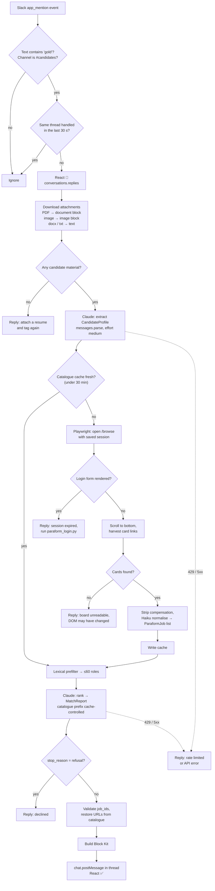
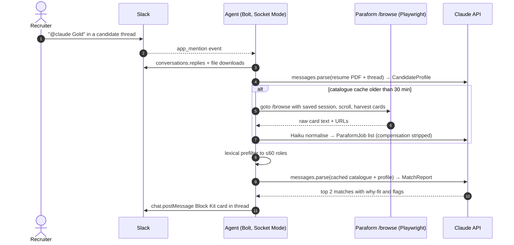

# Gold: Slack → Paraform candidate-matching agent

Trigger `@claude Gold` (or `gold`, any case) inside a candidate thread in `#candidates`.
The agent reads the thread, builds a structured candidate profile, pulls the live Paraform
board, ranks roles on skills / seniority / location / domain, and replies in the thread
with a Block Kit card. Compensation is stripped before the model ever sees a role and the
rubric forbids it as a factor.

## 0. Reality check before the design

**Paraform has no public API.** Verified on 2026-09-16:

| Probe | Result |
|---|---|
| `GET https://www.paraform.com/browse` (unauthenticated) | HTTP 200, but the body is the login form (`Log in \| Paraform`, "Continue with Google / Email") |
| `docs.paraform.com` | DNS does not resolve |
| `GET /api/trpc` | 404 |
| `sitemap.xml` | Marketing, blog, insights and `/category/*` pages only. Zero job or company URLs |
| `robots.txt` | Only disallows `/share/c/` (candidate share links) |

So the `GET /v1/jobs` call in the original sketch (and the `requests.get("https://paraform.com")`
line in the sample orchestrator) cannot work. The catalogue has to come from an authenticated
browser session driven by Playwright, using a recruiter's own Paraform login. That decision
shapes the tool list, the error handling and the ops checklist below.

## 1. Persona, goal, constraints

**Persona.** A senior agency recruiter's research analyst: terse, evidence-first, never
speculates about a person, always says what it could not verify.

**Goal.** Given one candidate thread, return the 1–2 Paraform roles most worth submitting to,
each with a 0–100 score, concrete "why it fits" bullets and concrete flags, in under ~90 seconds.

**Constraints.**
- Only responds to `app_mention` events whose text contains the word `gold` (word-bounded,
  case-insensitive), optionally restricted to `CANDIDATES_CHANNEL_ID`.
- Compensation is out of scope twice over: stripped from scraped text with a regex before
  normalisation, and forbidden by the scoring rubric.
- Never invents profile facts. Missing location / years / work authorisation are reported as
  `source_gaps`, not guessed.
- Never trusts the model with URLs or ids: every match's `job_id` is validated against the
  catalogue and its URL is rewritten from the catalogue.
- Read-only against Paraform, single logged-in session, one scrape per cache window
  (default 30 min). The "Submit Candidate" button is a deep link, not a write.
- Candidate PDFs are sent to the Claude API and not stored on disk.

## 2. Tools

| Tool | Purpose | Implementation |
|---|---|---|
| Slack Events (`app_mention`) | Trigger | slack-bolt, Socket Mode (no public URL) |
| `conversations.replies` | Read the whole thread, not just the mention | slack-sdk |
| File download (`url_private_download`) | Resume PDF, screenshots, docx | requests + bot token |
| PDF / image understanding | Read the resume as-is | Claude `document` / `image` content blocks (no OCR library) |
| Paraform browse scraper | Live catalogue | Playwright Chromium + persisted `storage_state` |
| Catalogue normaliser | Raw card text → `ParaformJob` | Claude Haiku 4.5 via `messages.parse` |
| Disk cache | One scrape per window | JSON file, TTL |
| Lexical prefilter | Cap catalogue to ≤60 roles | Pure Python |
| Profile extractor | Thread → `CandidateProfile` | `claude-opus-5`, `messages.parse`, effort `medium` |
| Matcher | Profile + catalogue → `MatchReport` | `claude-opus-5`, adaptive thinking, cached catalogue prefix |
| Block Kit renderer | Slack card | Pure function, unit-tested |
| `chat.postMessage` / `reactions.add` | Reply and status | slack-sdk |

Not used, and why: a LinkedIn fetcher (LinkedIn blocks it; links are passed to the model as
"mentioned, not fetched"), a vector DB (the board is a few hundred roles; a cached prompt
prefix is cheaper and simpler), LangChain (two structured calls do not need an orchestration
framework).

## 3. Workflow





## 4. Code layout

```
app/
  config.py     env → Settings
  models.py     Pydantic: ParaformJob, CandidateProfile, JobMatch, MatchReport
  slack_io.py   trigger regex, thread reading, attachment → Claude content blocks
  paraform.py   Playwright scrape, login-wall detection, comp stripping, Haiku normalise, cache
  matcher.py    prefilter + the two Opus calls (structured outputs, cached catalogue prefix)
  blocks.py     Block Kit builder (pure)
  main.py       Bolt app, app_mention handler, error → thread reply
scripts/paraform_login.py   one-time headed login, saves storage_state.json
slack/match_message.blocks.json   sample card, generated from blocks.py
tests/                      trigger, prefilter, comp stripping, block shape
```

## 5. Setup

1. Slack app: scopes `app_mentions:read`, `channels:history`, `groups:history`, `chat:write`,
   `files:read`, `reactions:write`; enable Socket Mode; subscribe to `app_mention`; install;
   invite the bot to `#candidates`.
2. `cp .env.example .env` and fill tokens.
3. `pip install -r requirements.txt && playwright install chromium`
4. `python scripts/paraform_login.py` on a machine with a display; copy `paraform_state.json`
   to the server as a secret file.
5. `python -m app.main` (or the Dockerfile; mount the state file, never bake it in).

## 6. Known risks

- **Session expiry.** Google-SSO cookies on Paraform will expire; the agent detects the login
  form and posts a clear "re-run login" message instead of hallucinating an empty board.
- **DOM drift.** Card harvesting is heuristic (on-site anchors with ≥25 chars of text). When
  Paraform redesigns, `ParaformScrapeError` fires and the thread gets a plain-language error.
  If they add a JSON endpoint, swap `scrape_browse_page` for a response-interception version.
- **Terms of use.** This automates a recruiter's own logged-in session, read-only, at a low
  rate. Confirm that is acceptable under Paraform's recruiting agreement before running it
  against production accounts.
- **Card text thinness.** Browse cards may carry only title/company/location. Set
  `PARAFORM_MAX_DETAIL_PAGES` to fetch N detail pages per scrape for richer requirements.
- **Cost.** Per request: one Opus profile call (a PDF is a few thousand tokens), one Opus
  ranking call with a mostly cached ~20–40K-token catalogue prefix, plus one Haiku
  normalisation per cache window. Roughly cents per candidate, not dollars.
